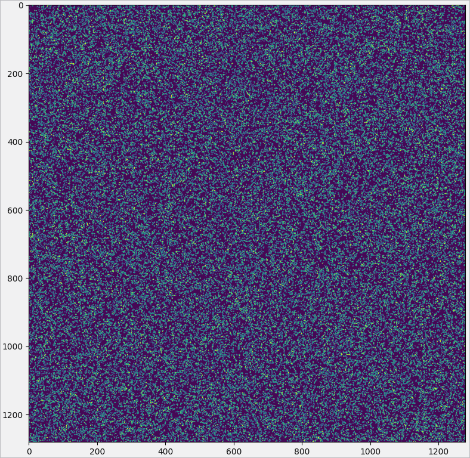

# Conway's Game of Life

This repo contains a few implementations of [Conway's Game of Life](https://www.wikiwand.com/en/Conway%27s_Game_of_Life). I mainly wrote these as a learning exercise in grid parallelization and [Julia](https://julialang.org/). They are probably not written particularly well but served their purpose. Some interesting results are:
- Parallelizing Python by starting every grid point on a new thread made it several orders of magnitude slower, if I added a sleep to the points' calculation function it was faster, so this could be useful for grids with very complex calculations.
- Splitting the grid sub grids with one sub grid for each CPU thread worked moderately well yielding a 5 times speed increase with 16 threads for an n=1280 grid (I would guess that this is because of the dispatch being slower than the actual grid computation)
- Rewriting in Julia was very easy and yielded a 20 times speed increase over the single threaded version
- Parallelization was then very easy again as you just have to add `Threads.@threads` before the `for` in a for loop and then run it with `julia --threads n` for n threads. This yielded a 3 times speed increase over the serial Julia version (again presumably because the grid is actually very simple)

An example grid:

The quotes speed increases are from runs with `n=1280`, 10 time steps and 16 threads for parallel versions. The results are in the table below:

|Name|Time/s|Increase|
|:--- | ---: | :---:|
|Python Serial| 13.1±0.2|1|
|Python Parallel|2.33±0.08|5.62|
|Julia Serial|0.67±0.1|19.6|
|Julia Parallel|0.22±0.08|59.5|